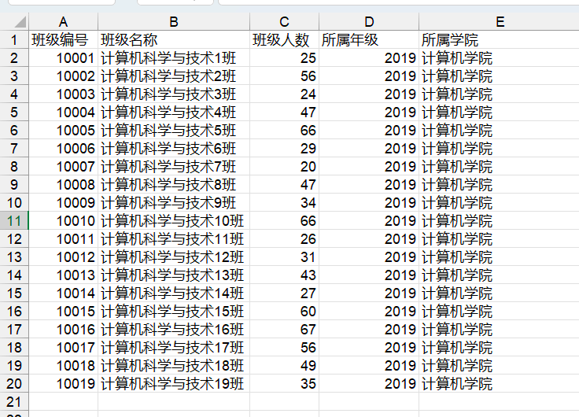
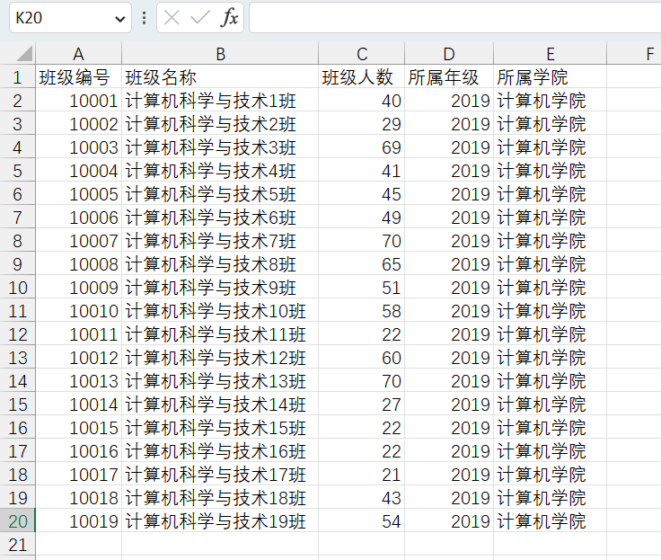

## POI操作excel

### 依赖

```xml
<dependency>
    <groupId>org.apache.poi</groupId>
    <artifactId>poi</artifactId>
    <version>5.2.2</version>
</dependency>

<dependency>
    <groupId>org.apache.poi</groupId>
    <artifactId>poi-ooxml</artifactId>
    <version>5.2.2</version>
</dependency>

<dependency>
    <groupId>org.apache.poi</groupId>
    <artifactId>poi-ooxml-schemas</artifactId>
    <version>4.1.2</version>
</dependency>
```


### 版本区别

在POI包中有如下几个主要对象和excel的几个对象对应：

| 对应excel名称 | 低版本中的类名 | 高版本中的类名 |
| :-----------: | :------------: | :------------: |
|    工作簿     |  HSSFWorkbook  |  XSSFWorkbook  |
|    工作表     |   HSSFSheet    |   XSSFSheet    |
|      行       |    HSSFRow     |    XSSFRow     |
|    单元格     |    HSSFCell    |    XSSFCell    |
|  单元格样式   | HSSFCellStyle  | XSSFCellStyle  |


### 导出excel

低版本：

```java
package mao;

import org.apache.poi.hssf.usermodel.HSSFWorkbook;
import org.apache.poi.ss.usermodel.Cell;
import org.apache.poi.ss.usermodel.Row;
import org.apache.poi.ss.usermodel.Sheet;
import org.apache.poi.ss.usermodel.Workbook;

import java.io.FileNotFoundException;
import java.io.FileOutputStream;
import java.io.IOException;

/**
 * Project name(项目名称)：java报表_POI导出excel
 * Package(包名): mao
 * Class(类名): Test1
 * Author(作者）: mao
 * Author QQ：1296193245
 * GitHub：https://github.com/maomao124/
 * Date(创建日期)： 2023/6/1
 * Time(创建时间)： 14:44
 * Version(版本): 1.0
 * Description(描述)： POI导出-低版本
 */

public class Test1
{

    /**
     * 得到int随机
     *
     * @param min 最小值
     * @param max 最大值
     * @return int
     */
    public static int getIntRandom(int min, int max)
    {
        if (min > max)
        {
            min = max;
        }
        return min + (int) (Math.random() * (max - min + 1));
    }

    public static void main(String[] args) throws IOException
    {
        //创建工作簿
        Workbook workbook = new HSSFWorkbook();
        //创建工作表
        Sheet sheet = workbook.createSheet("班级信息");
        //创建行，第0行
        Row row = sheet.createRow(0);
        //创建单元格
        Cell cell = row.createCell(0);
        //填充数据
        cell.setCellValue("班级编号");
        //创建单元格
        cell = row.createCell(1);
        //填充数据
        cell.setCellValue("班级名称");
        //创建单元格
        cell = row.createCell(2);
        //填充数据
        cell.setCellValue("班级人数");
        //创建单元格
        cell = row.createCell(3);
        //填充数据
        cell.setCellValue("所属年级");
        //创建单元格
        cell = row.createCell(4);
        //填充数据
        cell.setCellValue("所属学院");


        for (int i = 1; i < 20; i++)
        {
            //创建行，第i行
            row = sheet.createRow(i);
            //创建单元格
            cell = row.createCell(0);
            cell.setCellValue(10000 + i);

            cell = row.createCell(1);
            cell.setCellValue("计算机科学与技术" + i + "班");

            cell = row.createCell(2);
            cell.setCellValue(getIntRandom(20, 70));

            cell = row.createCell(3);
            cell.setCellValue(2019);

            cell = row.createCell(4);
            cell.setCellValue("计算机学院");
        }

        //关闭
        try (FileOutputStream fileOutputStream = new FileOutputStream("class.xls"))
        {
            //写入
            workbook.write(fileOutputStream);
            //关闭
            workbook.close();
        }
    }
}
```





高版本：

```java
package mao;

import org.apache.poi.hssf.usermodel.HSSFWorkbook;
import org.apache.poi.ss.usermodel.Cell;
import org.apache.poi.ss.usermodel.Row;
import org.apache.poi.ss.usermodel.Sheet;
import org.apache.poi.ss.usermodel.Workbook;
import org.apache.poi.xssf.usermodel.XSSFWorkbook;

import java.io.FileOutputStream;
import java.io.IOException;

/**
 * Project name(项目名称)：java报表_POI导出excel
 * Package(包名): mao
 * Class(类名): Test2
 * Author(作者）: mao
 * Author QQ：1296193245
 * GitHub：https://github.com/maomao124/
 * Date(创建日期)： 2023/6/1
 * Time(创建时间)： 15:07
 * Version(版本): 1.0
 * Description(描述)： POI导出-高版本
 */

public class Test2
{
    /**
     * 得到int随机
     *
     * @param min 最小值
     * @param max 最大值
     * @return int
     */
    public static int getIntRandom(int min, int max)
    {
        if (min > max)
        {
            min = max;
        }
        return min + (int) (Math.random() * (max - min + 1));
    }

    public static void main(String[] args) throws IOException
    {
        //创建工作簿
        Workbook workbook = new XSSFWorkbook();
        //创建工作表
        Sheet sheet = workbook.createSheet("班级信息");
        //创建行，第0行
        Row row = sheet.createRow(0);
        //创建单元格
        Cell cell = row.createCell(0);
        //填充数据
        cell.setCellValue("班级编号");
        //创建单元格
        cell = row.createCell(1);
        //填充数据
        cell.setCellValue("班级名称");
        //创建单元格
        cell = row.createCell(2);
        //填充数据
        cell.setCellValue("班级人数");
        //创建单元格
        cell = row.createCell(3);
        //填充数据
        cell.setCellValue("所属年级");
        //创建单元格
        cell = row.createCell(4);
        //填充数据
        cell.setCellValue("所属学院");


        for (int i = 1; i < 20; i++)
        {
            //创建行，第i行
            row = sheet.createRow(i);
            //创建单元格
            cell = row.createCell(0);
            cell.setCellValue(10000 + i);

            cell = row.createCell(1);
            cell.setCellValue("计算机科学与技术" + i + "班");

            cell = row.createCell(2);
            cell.setCellValue(getIntRandom(20, 70));

            cell = row.createCell(3);
            cell.setCellValue(2019);

            cell = row.createCell(4);
            cell.setCellValue("计算机学院");
        }

        //关闭
        try (FileOutputStream fileOutputStream = new FileOutputStream("class.xlsx"))
        {
            //写入
            workbook.write(fileOutputStream);
            //关闭
            workbook.close();
        }
    }
}
```





